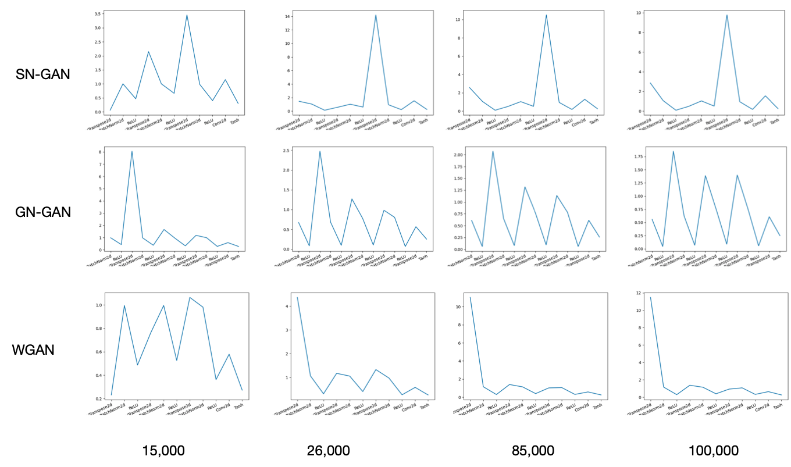

---
keywords:
    - generative adversarial model
    - GAN
comments: true
title: 
---

Recently a paper named : Characterizing signal propagation to close the performance gap in unnormalized ResNets caught my eyes because Brock et al suggest by ploting the signal propogation plots (SPP) you can debug the possible bugs in your networks. Since GANs study has largely focus in stabilizing the training process (although recent years theres been a shift to more stable method such as denoising diffussion, VAE methods ), the possible of using SPP as a probe tools to debug GANs is still quite attractive.

#### Training settings:

1. All models are trained using [pytorch-gan-collections](https://github.com/w86763777/pytorch-gan-collections) on CIFAR-10 without any conditional priors ( unlabel image generation )

2. Models are trained for 100k iterations, under the default settings given by the original code

3. 3 commonly found methods are used to regularized the training of GANs : Spectral normalizer, wassertein distance as loss and gradient normalization. They are compared against the baseline DCGAN in CNN architecture

## Results

This is a comparison of different activation means in different layers, I choose the mean activation at 12k, 26k, 85k and 100k iterations because tensorboard only shown these points at the final results.

The code for ploting SPP is available at this [gist](https://gist.github.com/theblackcat102/62a1795535b0aa220eeeaf804cc1a458)

(to be continued...)

